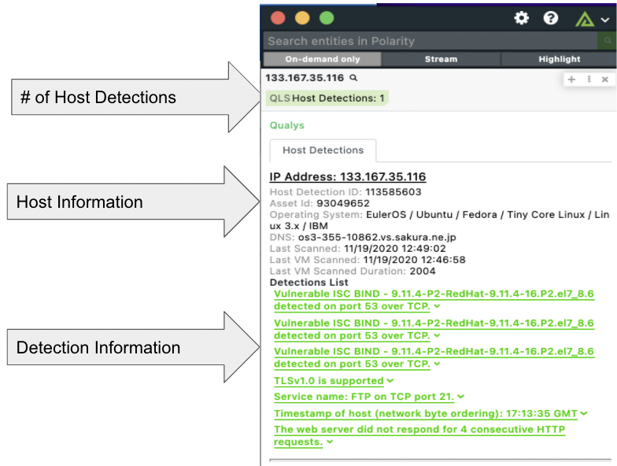
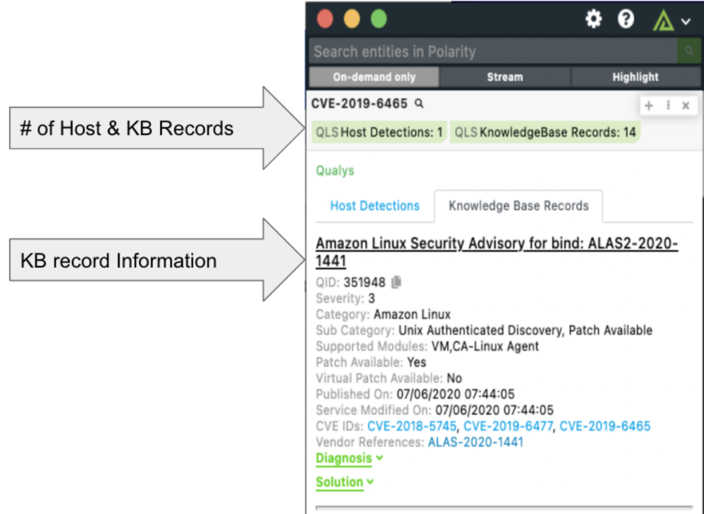

# Polarity Qualys Integration


The Qualys Cloud Platform helps businesses simplify security operations and lower the cost of compliance by delivering critical security intelligence on demand and automating the full spectrum of auditing, compliance and protection for IT systems and web applications.  The Polarity Qualys Integration queries the Qualys Cloud Platform's Host Detection List and KnowledgeBase for IP Addresses, Domains, CVEs and optionally QIDs.

<div style="display:flex; align-items: flex-start;">
  
  
</div>

To learn more about Qualys, visit the [official website](https://www.qualys.com/).


## Integration Limitations
### Host Detection List Lookup Limits
Qualys' Host Detection List API only allows lookups on IP Addresses, so only IP Addresses will show Host Detection List results.

### IP Address Limits
Qualys' search API is relatively limited in the data is returns, what is searchable, and how many searches can be done at once.  Slower lookup times when simultaneous lookups are being run with IP Addresses are to be expected.

### KnowledgeBase Limits
Currently, Qualys' KnowledgeBase API is unsearchable, so we are downloading the entire KnowledgeBase on your Polarity Server and doing lookups locally so you can access your Qualys KnowledgeBase Data.  This download process is run on Integration Restart and when saving User Options, as well as refreshes every night at midnight.  The refresh process will take some time, and during the initial download process you will not be able to obtain results from the KnowledgeBase, but can search the Host Detections List.

> ***NOTE:*** The KnowledgeBase Download/Refresh process and the KnowledgeBase Lookups have only been tested on a Qualys instance with around 250MB of Data and took approximately 15 minutes to finish.  Some KnowledgeBase instances could be 100GB+ which could severely hinder the KnowledgeBase Download/Refresh process time and the KnowledgeBase Lookup times.  If this is causing you issues, please let us know at support@polarity.io.  If you wish to only query the Host Detections List with IP Addresses, set the `disableKnowledgeBase` property in the `./config/config.js` file to `true` and restart your integration.

## Qualys Integration Config Options
> ***NOTE:*** In order for this integration to function, you must set the `url`, `username`, `password`, and `dataRefreshTime` properties in the `./config/config.js` file, and restart this Integration.  Any updates to these properties will also require a restart of the Integration.

### Qualys URL
The URL of the Qualys you would like to connect to (including http:// or https://)

### Qualys Username
The Username for your Qualys Account

### Qualys Password
The Password associated with the Qualys Account

### KnowledgeBase Refresh Time
How often/when to refresh the local data source with the up to date data from the Qualys KnowledgeBase API.  This is outline in Cron Format and is defaulted to the first of every month at midnight UTC. If you would like to never update your database after the initial install, set this string to `never-update`.  Helpful Resources: https://crontab.guru/ .
```
'* * * * * *'
 ┬ ┬ ┬ ┬ ┬ ┬
 │ │ │ │ │ └ day of week (0 - 7) (0 or 7 is Sun)
 │ │ │ │ └── month (1 - 12)
 │ │ │ └──── day of month (1 - 31)
 │ │ └────── hour (0 - 23)
 │ └──────── minute (0 - 59)
 └────────── second (0 - 59, OPTIONAL)
'42 * * * *' -> Execute when the minute is 42 (e.g. 19:42, 20:42, etc.).
'*/5 * * * *' -> Execute every 5th minute
'0 0 1 * *' -> Execute at 00:00 on day-of-month 1 (current default).
'never-update' -> Never Update after initial install of the database
```


## Installation Instructions

Installation instructions for integrations are provided on the [PolarityIO GitHub Page](https://polarityio.github.io/).


## Polarity

Polarity is a memory-augmentation platform that improves and accelerates analyst decision making.  For more information about the Polarity platform please see:

https://polarity.io/
